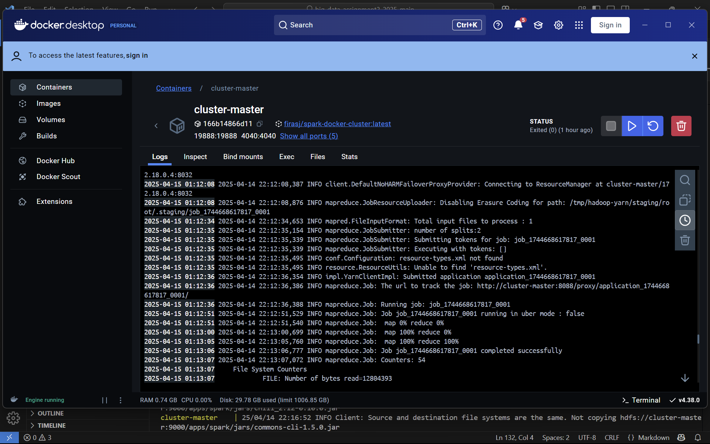
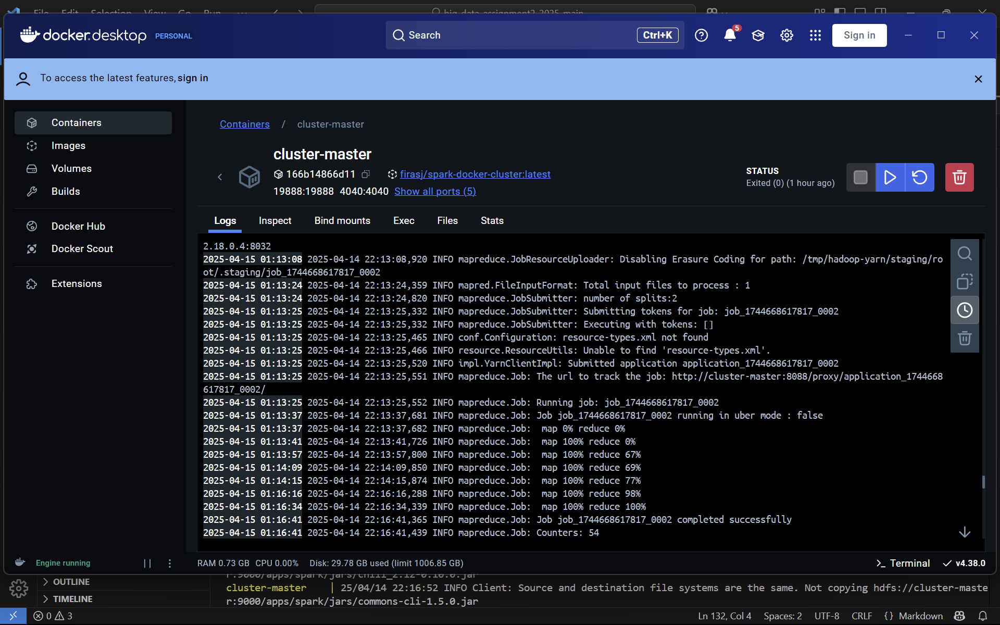
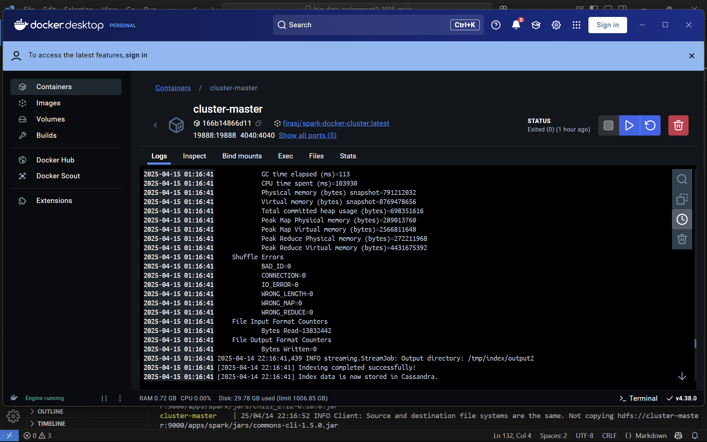
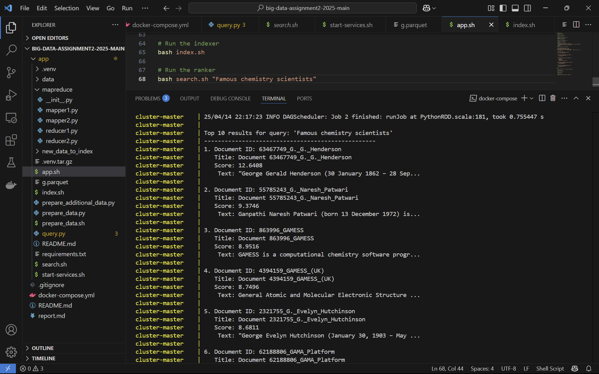
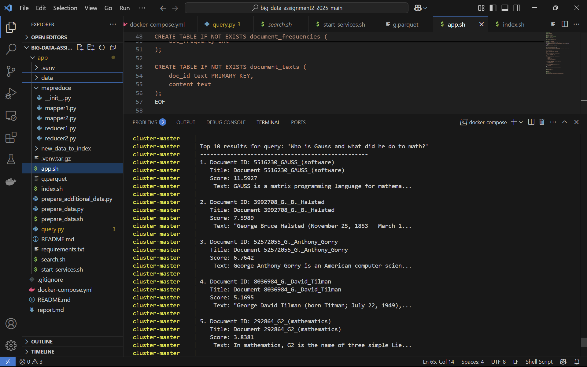
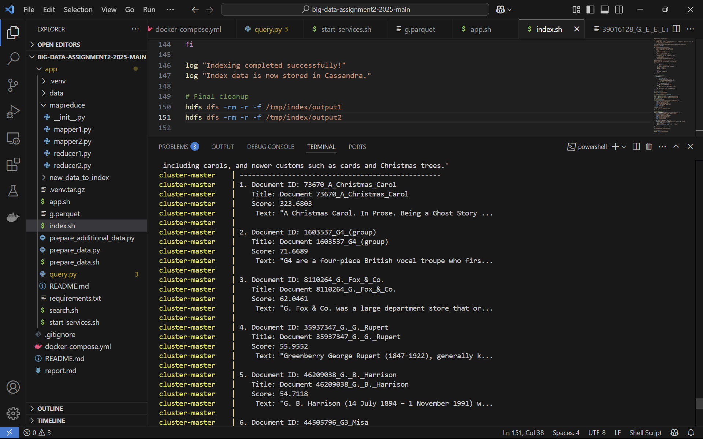

# **Simple Search Engine Report**  
**Assignment 2: Simple Search Engine using Hadoop MapReduce, Cassandra, and other powerful tools**  
**Student**: Davydov Danil
**Group**: DS-01
**Innnopolis email address**: d.davydov@innopolis.university
**Telegram**: @tanellD

---

## **1. Introduction** 
- In this assignment I was asked to implement simple search engine using Spark, Cassandra, HDFS. I gained knowledge in doing it, also I implemented Map-Reduce pipelines
---

## **2. Methodology**  
### **2.1 Design Choices**  
- **Data Pipeline**: The script prepare_data.sh and prepare_data.py are used to read parquet file, select 1000 texts and save them into app/data folder, in .sh script those files are copied to hdfs and in .py the csv file is saved into /index/data as index of files. If the user wants to index addditional files he should paste .txt files into a new folder and pass the folder path into index.sh as an argument to index additional documents. The documents are concatenated to the files that were indexed in prepare_data scripts. Next I have 2 Map-Reduce pipelines to store files in cassandra, during this pipelines all metrics for BM25 calculation will be determined and stored in cassandra. The last stage is searching with search.sh and query.py. With this scripts I calculate scores for each document by the query and print top-10 the most relevant documents. The output has filename, score, and part of a text.
The pipeline looks as follows:
parquet file ---> prepare_data scripts ---> index.sh ---> 2 Map-Reduce pipelines ---> search for relevant
<span style="opacity:0">-----------------------------------------------------------</span>^
<span style="opacity:0">-----------------------------------------------------------</span>|
<span style="opacity:0">_______________</span>folder with additional files to index (optional)
- **Indexing Strategy**: My cassandra schema is defined by script:
```cql
CREATE KEYSPACE IF NOT EXISTS document_index
WITH replication = {'class': 'SimpleStrategy', 'replication_factor': '1'};

USE document_index;

CREATE TABLE IF NOT EXISTS vocabulary (
    term text PRIMARY KEY
);

CREATE TABLE IF NOT EXISTS document_lengths (
    doc_id text PRIMARY KEY,
    doc_length int
);

CREATE TABLE IF NOT EXISTS term_frequencies (
    term text,
    doc_id text,
    frequency int,
    PRIMARY KEY (term, doc_id)
);

CREATE TABLE IF NOT EXISTS document_frequencies (
    term text PRIMARY KEY,
    doc_frequency int
);

CREATE TABLE IF NOT EXISTS document_texts (
    doc_id text PRIMARY KEY,
    content text
);
```

The table `document_texts` is created to show slice of a text in output, other tables are needed to calculate BM25 score for documents by query. The initialization of schema is in app.sh script.
- **Ranking Model**: The bm25 has 2 parameters which I defined as  k1 = 1.2 and b = 0.75

### **2.2 Implementation Details**  
#### **Indexer (MapReduce Pipeline)**  
- I splitted the code into 2 MapReduce pipelines the first calculates all metrics while the second loads them into cassandra, such that my code is simpler to understand.

#### **Ranker (Spark RDD)**  
- **Query Processing**: I used the same strategy to preprocess the texts and query, I remove stopwords and stem the tokens.  
- **BM25 Calculation**: I use a modification of BM25 to rank documents (Variant Lucene/Elasticsearch), the calculation looks like
##### BM25 Scoring Formula (Lucene/Elasticsearch Variant)

##### IDF (Inverse Document Frequency):
\[
IDF(t) = \log \left( \frac{N - df(t) + 0.5}{df(t) + 0.5} + 1 \right)
\]

##### TF (Term Frequency):
\[
TF(t, d) = \frac{tf(t, d) \cdot (k_1 + 1)}{tf(t, d) + k_1 \cdot \left( 1 - b + b \cdot \frac{|d|}{avgdl} \right)}
\]

##### Full BM25 Score:
\[
\text{Score}(q, d) = \sum_{t \in q} IDF(t) \cdot TF(t, d)
\]

Here is the comparison of classic BM25 and Variant Lucene/Elasticsearch:
##### BM25 vs. Lucene/Elasticsearch BM25 Variants: IDF and Score Ranges

| Feature | Classic BM25 | Lucene/Elasticsearch BM25 |
|---------|-------------|---------------------------|
| **IDF for Common Terms** | Can go negative for very common terms | Always non-negative due to the "1+" term |
| **IDF for Terms in All Docs** | Negative values possible | Floors at 0 to avoid negative contribution |
| **Score Range - Lower Bound** | Can produce negative scores for common terms | Always non-negative scores |
| **Impact on Ranking** | Higher contrast between common and rare terms | More balanced influence between common and rare terms |

- **Top-K Retrieval**: Spark operations to rank and filter results.  
I use spark RDD for calculating BM25 score in parallel in query.py:
```python
# other code
doc_ids_rdd = sc.parallelize(list(doc_lengths.keys()))
# other code
```
```python
# other code
doc_scores = doc_ids_rdd.map(
    lambda doc_id: (
        doc_id, 
        calculate_bm25(
            query_terms, 
            doc_id, 
            doc_lengths.get(doc_id, 0), 
            avg_doc_len, 
            term_freqs, 
            doc_freqs, 
            total_docs
        )
    )
)

top_docs = doc_scores.sortBy(lambda x: -x[1]).take(10)
# other code
```

## **3. Demonstration**  
### **3.1 How to Run the Project**  
Run
```bash
docker-compose build
docker-compose up
```

If you want to chage query: change it directly in the end of app.sh:
```bash
bash search.sh "paste_your_query"
```

If you want to index additional documents add path to the folder with additional txt files:
```bash
bash index.sh /app/your_folder
```

### **3.2 Screenshots & Results**  
#### **Indexing Success**  
- **Screenshot 1**: Fullscreen terminal output showing successful indexing of documents.  
   
   
    

#### **Query Execution**  
- **Query 1**: "Famous chemistry scientists"
    

- **Query 2**: "Who is Gauss and what did he do to math?"  
   

- **Query 3**: "A Christmas Carol. In Prose. Being a Ghost Story of Christmas, commonly known as A Christmas Carol, is a novella by Charles Dickens, first published in London by Chapman & Hall in 1843 and illustrated by John Leech. A Christmas Carol recounts the story of Ebenezer Scrooge, an elderly miser who is visited by the ghost of his former business partner Jacob Marley and the spirits of Christmas Past, Present and Yet to Come. After their visits, Scrooge is transformed into a kinder, gentler man. Dickens wrote A Christmas Carol during a period when the British were exploring and re-evaluating past Christmas traditions, including carols, and newer customs such as cards and Christmas trees."  

Caption: this query is used with additional documents that were indexed, the folder is app/new_data_to_index
this path was used as the argument to index.sh script. This query is a demonstration that my code can index additional documents

--- 